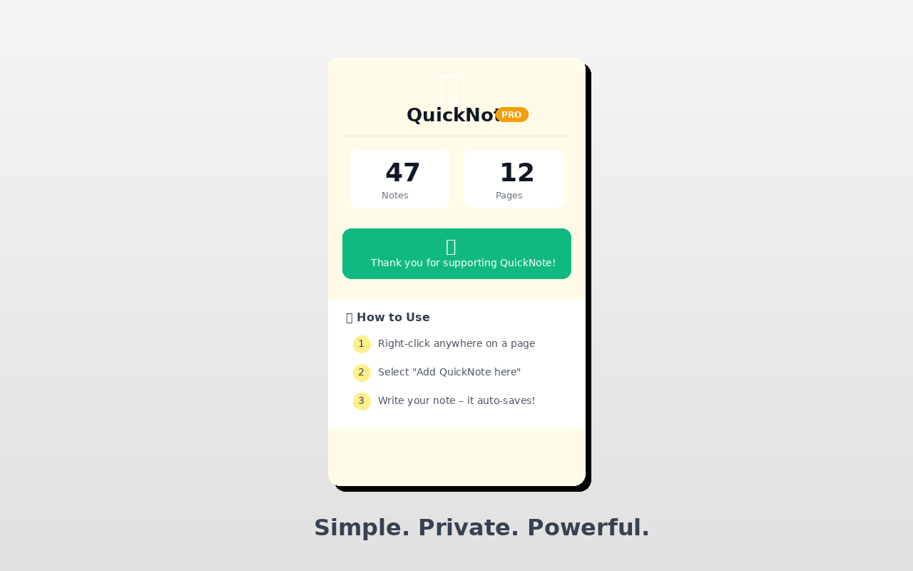
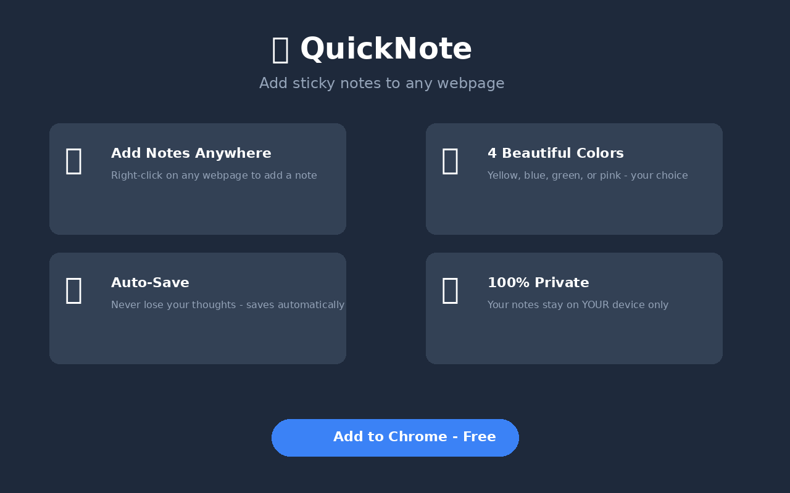

# 📝 QuickNote — Webpage Annotator & Cheat Sheet

A lightweight Chrome/Edge extension (Manifest V3) that lets you drop **sticky notes on any webpage**. Notes persist between visits, and a built-in **payload cheat sheet** makes it handy for research, studying, and web-security practice (PortSwigger / SQLi labs).

No accounts, no servers, no tracking — everything is stored locally in your browser.


## ✨ Features

- **Sticky notes anywhere** — right-click a page and add a draggable, resizable note.
- **Global notes** — pin a note that shows on *every* page. Perfect for a cheat sheet that follows you across sites (and survives PortSwigger's changing lab subdomains).
- **Built-in SQLi cheat sheet** — categorized payloads (UNION, column count, DB version, blind, time-based…) with one-click copy.
- **One-click copy & code mode** — copy a note's text instantly, and toggle monospace for payloads and code.
- **Notes manager** — search every note, jump to (“Reveal”) a note on the current page, copy, or delete it from the popup. No more lost notes.
- **Color themes** — yellow, blue, green, pink.
- **JSON backup** — export and import all your notes.
- **Auto-save** — notes save as you type.





## 🚀 Install (from source)

1. Download or clone this repo.
2. Open `chrome://extensions` (or `edge://extensions`).
3. Enable **Developer mode** (top-right).
4. Click **Load unpacked** and select this folder.
5. The 📝 icon appears in your toolbar.

## 📖 How to use

1. **Right-click** anywhere on a page.
2. Choose **“Add QuickNote here”** — or **“Add global QuickNote”** for a note shown on every page.
3. Write your note. It **auto-saves**.
4. Drag by the header, resize from the corner, pick a color, toggle code mode, or copy the text.
5. Open the toolbar popup to search all notes, browse the cheat sheet, or back up your data.


## 🔒 Permissions

| Permission | Why |
|---|---|
| `storage` | Save your notes locally |
| `contextMenus` | Add the right-click "Add QuickNote" items |
| `activeTab` | Talk to the current tab to place and reveal notes |

The content script runs on all pages so notes can appear anywhere. It never sends data anywhere — there is no network code.

## 🗂️ Project structure

```
manifest.json     Extension config (MV3)
background.js     Service worker: context menu + storage (page & global notes)
content.js        Injected script: renders/drag/resize/copy notes on the page
content.css       Note styling
popup.html/css/js Toolbar UI: notes manager, cheat sheet, backup
icons/            Icons + store screenshots
```

## 🛠️ Notes for contributors

- Pure vanilla JS, no build step. Edit and reload the unpacked extension.
- Storage model: `notes` is `{ [origin+pathname]: Note[] }`; `global` is `Note[]` shown everywhere.
- Extend the cheat sheet by editing the `CHEAT_SHEET` array in `popup.js`.

## ⚠️ Disclaimer

The cheat sheet is provided for **authorized security testing and education only** (e.g. PortSwigger Web Security Academy, your own lab environments). Only test systems you have explicit permission to test.

## 📄 License

[MIT](LICENSE) — free to use, modify, and share.
