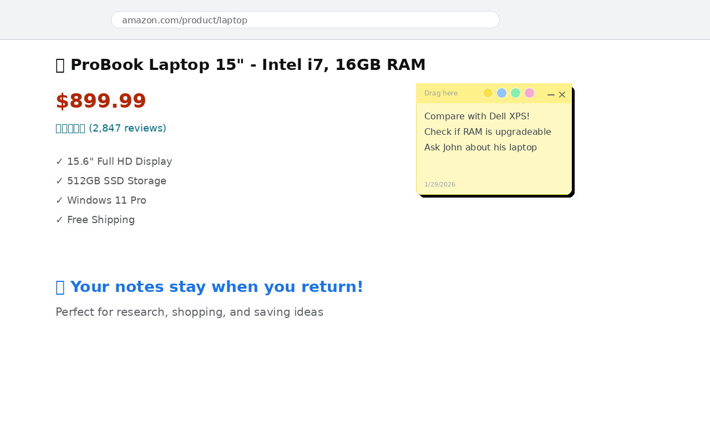
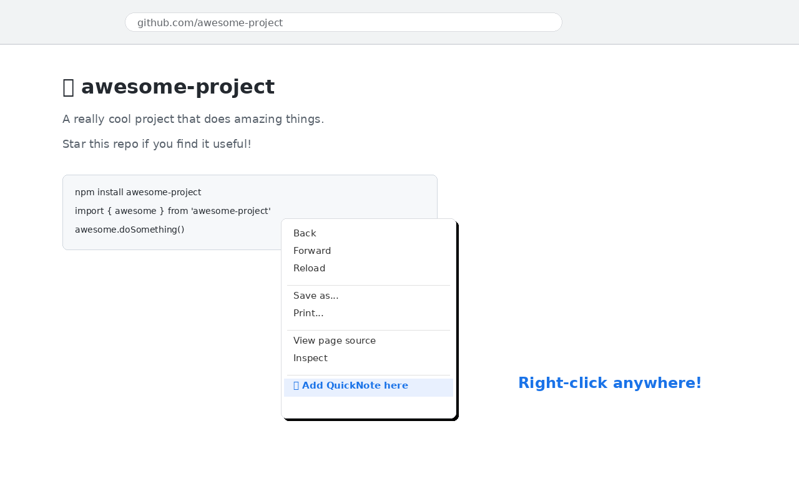

# 📝 QuickNote — Webpage Annotator & Cheat Sheet

A lightweight **Chrome / Edge** extension (Manifest V3) that lets you drop **sticky notes on any webpage** and keep a personal **cheat sheet** of copy-ready snippets. Notes persist between visits, and "global" notes follow you across every site.

Great for research, studying, online shopping, and security practice (PortSwigger / lab work).

**No accounts, no servers, no tracking — everything stays in your browser.**



> ℹ️ The screenshots above may lag behind the latest UI — see the current version for the up-to-date look.

## ✨ Features

- **Sticky notes anywhere** — right-click a page and add a draggable, resizable note that auto-saves.
- **Global notes** — hit the **📌** button to make a note show on *every* page. Perfect for a cheat sheet that follows you across sites (and survives PortSwigger's changing lab subdomains).
- **Your own cheat sheet** — build a personal snippet library (payloads, commands, boilerplate) with click-to-copy, categories, favorites, and search.
- **Importable packs** — load ready-made snippet packs from the [`cheatsheets/`](cheatsheets/) folder (SQLi, XSS, command injection, regex, Linux, Docker, Git, email templates…), or export your own to share.
- **Snippet placeholders** — put `{{name}}` in a snippet and QuickNote prompts you to fill it in when you copy.
- **Any color** — a color picker on each note; text automatically stays readable on light or dark colors.
- **Notes manager** — search every note and **Reveal**, copy, or delete it from the popup. No more lost notes.
- **Live sync across tabs** — edits, colors, additions, and deletions update in other open tabs instantly, no refresh.
- **Dark mode** — the popup follows your system's light/dark setting automatically.
- **JSON backup** — export and import all your notes and snippets.

## 🚀 Install

### From the Chrome Web Store
_(Link coming once the listing is published.)_ One click — installs and auto-updates.

### From source (developer mode)

1. Click the green **Code** button on this page → **Download ZIP**, then unzip it to a permanent folder.
2. Open `chrome://extensions` (or `edge://extensions`).
3. Turn on **Developer mode** (top-right).
4. Click **Load unpacked** and select the unzipped folder.
5. The 📝 icon appears in your toolbar.

> Keep the folder where it is — deleting it removes the extension. Developer-mode installs don't auto-update.

## 📖 How to use

1. **Right-click** anywhere on a page and choose **"Add QuickNote here"**.
2. Write your note — it **auto-saves**.
3. Drag by the grip handle, resize from the corner, pick any color, toggle code mode, or copy the text.
4. Hit **📌** to make a note *global* so it shows on every page.
5. Open the toolbar popup to search notes, manage your **Cheat Sheet**, or **Backup** your data.
6. In the Cheat Sheet tab, click **Import** and pick a file from [`cheatsheets/`](cheatsheets/) to load a pack.



## 🔒 Privacy & permissions

QuickNote stores everything **locally** and has **no network code** — nothing is ever sent anywhere. See [PRIVACY.md](PRIVACY.md).

| Permission | Why |
|---|---|
| `storage` | Save your notes and snippets locally |
| `contextMenus` | Add the right-click "Add QuickNote here" item |
| `activeTab` | Interact with the current tab to place and reveal notes |
| `scripting` | Inject the note script into a tab on demand, so notes work without a page refresh |

## 🗂️ Project structure

```
manifest.json      Extension config (MV3)
background.js      Service worker: context menu, storage, on-demand injection
content.js         Injected script: renders / drags / resizes / colors notes
content.css        Note styling
popup.html/css/js  Toolbar UI: notes manager, snippet cheat sheet, backup
cheatsheets/       Importable snippet packs (SQLi, XSS, regex, Docker, Git…)
icons/             Extension icons + screenshots
PRIVACY.md         Privacy policy
```

## 🛠️ For contributors

- Pure vanilla JS, no build step — edit and reload the unpacked extension.
- Storage model: `notes` is `{ [origin+pathname]: Note[] }`, `global` is `Note[]` shown everywhere, `snippets` is your cheat-sheet library.
- Add a cheat-sheet pack: drop a JSON file in [`cheatsheets/`](cheatsheets/) following the format in its [README](cheatsheets/README.md).

## ⚠️ Disclaimer

The security packs (SQLi, XSS, command injection) are for **authorized testing and education only** — PortSwigger Web Security Academy, your own lab environments, or systems you have explicit permission to test.

## 📄 License

[MIT](LICENSE) — free to use, modify, and share.
